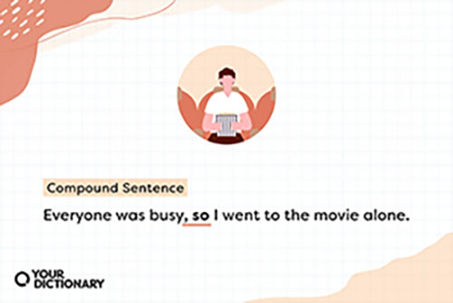

# Compound Sentence - Review Notes

| Abigail Lee | English | Period 3 |

## coordinating conjunction

FANBOYS is the acronym that stands for:

F - For 

A - And

N - Nor 

B - But

O - Or

Y - Yet

S - SO

## When do we use these?

We use coordinating conjuction to combine two complete thoughts to create a **compound sentence!**

## Example 

The coordinating conjuction, so, connected the two complete thought to create a compound sentence. 