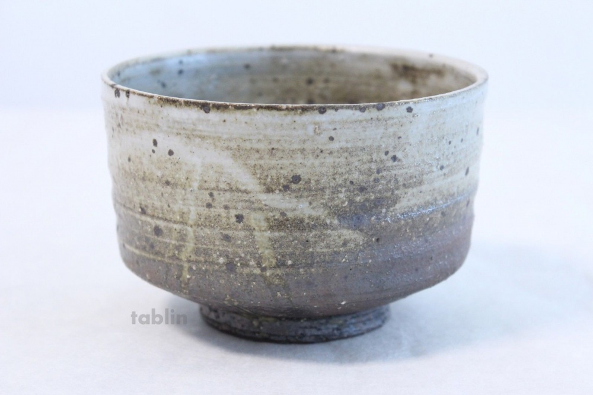
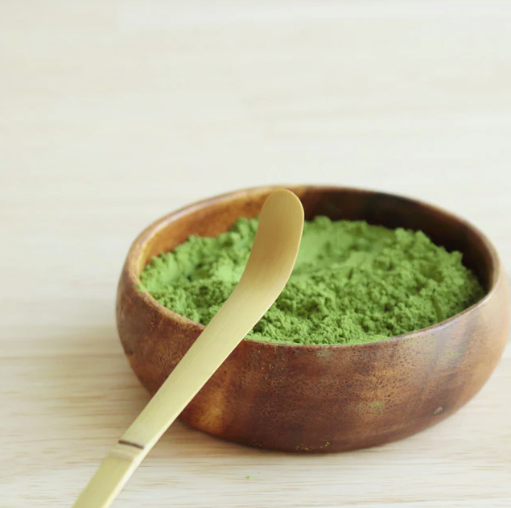

# Tea Bowl

Abigail Lee - Period 4 - Ceramics  

## Define Tea Bowl  

Tea Bowl 
: A centerpiece of a tea ceremony; has no handle and is meant for drinking tea. 

### Attention to detail 

In a tea ceremony there are three things people take into consideration.

1. Shape
1. Color
1. Texture 

### Article Summary -
The tea bowl was made from two different colors of clay. This is done by placing the two clay together and folding the two slabs together until they are mixed. Also, the shape of the bowl was created from a wheel and details were later added to give them unique texture and details. Then there were ridges created with a spatula while the bowl was being created on the wheel. A square-edge was then used to create a zigzag pattern on the bowl. Lastly, the bowl was given an irregular shape to the rim. 

#### Video Note -

A vessels/wares used in the tea ceremony is a tea scoop. It’s name is Chashaku and it is used to scoop the powder tea from the natsume (wooden container that stores Matcha). 

___

###### Website Link 

Link: [Tea Bowl](https://www.denverartmuseum.org/en/edu/object/tea-bowl)

