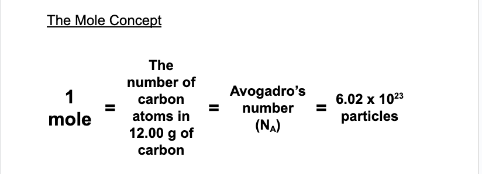
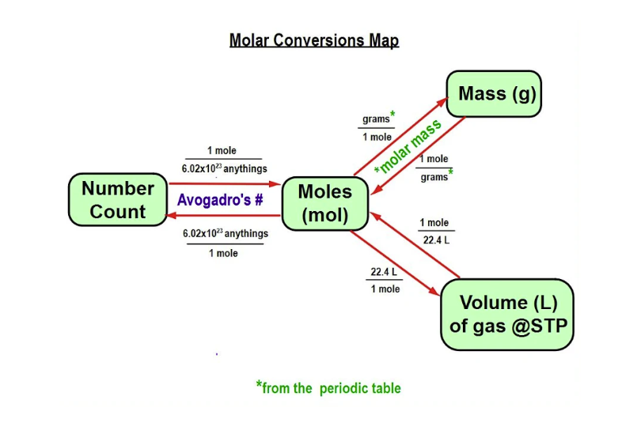

# The Mole Concept

Abigail Lee - Period 1 - Chemistry 

## Background Information

By finding instances in nature where two amounts of different elements have equal numbers of atoms, early chemists were able to find the relative masses of the atoms of each element.

* Relative masses can be used to compare the number of particles in samples of substances.

For convenience chemists initially agreed to define a standard number or “lump” of particles as the number of hydrogen atoms in 1.0 g of hydrogen. This number is called 1 mole (latin for “lump”).

#### Why do we mole? 

The mole provides a bridge that allows us to compare numbers of particles by measuring mass or gaseous volume. 

### IMPORTANT INFORMATION 
The atomic mass units on the periodic table are the number of grams per mole (g/mol)! 
This is also called MOLAR MASS.

Example:
* Compare the moles of atoms in 75.0 g of neon (Ne) and 75.0 g of argon (Ar).

75.0 g Ne * 1 mol / Ne20.18 g Ne=3.72 moles Ne
75.0 g Ar * 1 mol / Ar39.95 g Ar=1.88 moles Ar

## Conversion Map 

