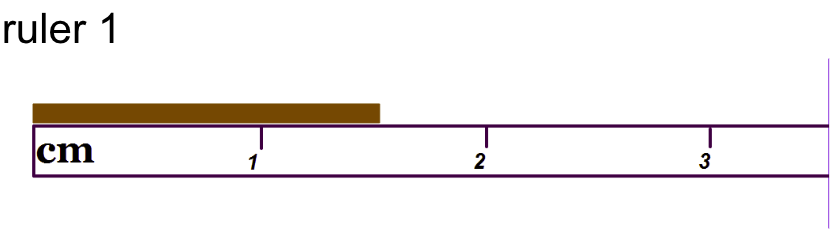
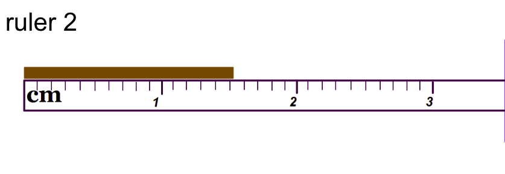

# Scientific Measurement 

Abigail Lee - Period 1 - Chemistry 

## Guess for ruler

Ruler 1 Guess - 1.4cm 
 

Number one is a certain digit while four is an uncertain digit 

Ruler 2 Guess- 1.52cm 

Number one and five is a certain digit and two is an uncertain digit.

#### Certain and uncertain digits 

* Certain digit are marked number and uncertain digit are estimation 

### Golden Rule 
Proper Measurement needs to have one estimated digit, no more no less

#### Precision and Accuracy 

* Precision is the amount of uncertainty.
* Accuracy is how close a measurement is to the true value. 

### Rules for graduated cylinders

 * A graduated cylinder is a way to measure the volume of a liquid. 
    

* Read the scale with your eyes at the level of the liquid 
* Read from the bottom of the meniscus (curve)

    

    ## Important 
    1. Don't try to add a specific amount!
    2. Always put the units
    3. Use laminate background to help you see the meniscus and scale marks. 

